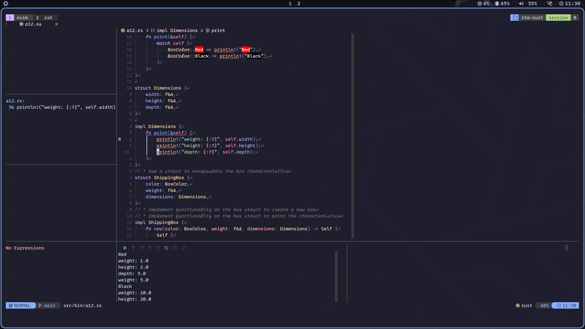

import { Icon } from 'astro-icon/components'



# What's Moon??

Moon is really similar to [Neve](https://github.com/thapasijan17/Moon), which is my Nixvim config. As some users wouldn't like to use Nix, I "ported" Neve to Lua and called it Moon because WhY NoT.

## Installation

You don't need nix to use Moon but just in case you'd like to use it, follow the second installation guide.

Try it before installing with: nix run github:thapasijan17/moon

### Installation Guide

```shell
1- Make a backup of your current Neovim config

# required

mv ~/.config/nvim{,.bak}

# optional but recommended

mv ~/.local/share/nvim{,.bak}
mv ~/.local/state/nvim{,.bak}
mv ~/.cache/nvim{,.bak}

2- Clone the repo:

- git clone https://github.com/thapasijan17/Moon ~/.config/nvim
- Remove the .git folder, so you can add it to your own repo later
- rm -rf ~/.config/nvim/.git
- Start Neovim
- nvim
```

### Installation Guide for Nix
I'm assuming you already use Nix flakes but in case you don't, please check this tutorial to enable it: [Flakes](https://nixos.wiki/wiki/Flakes)

```bash
1- Open flake.nix and add Moon.url = "github:thapasijan17/Moon" to your inputs.

2- Install it by adding inputs.Moon.packages.${system}.default to your environment.systemPackages or home.packages if you're using home-manager.

3- Rebuild your system and you should be done
```

## Quick Start
Moon is highly customizable. Here are some important files for configuring your environment:

- init.lua: Main file that loads Lazy.nvim.

- lua/keymaps.lua: This file contains custom key mappings. You can add your own keyboard shortcuts to enhance productivity.

- lua/sets.lua: Add or remove options and adjust their specific settings.

- lua/config/ In this directory you can add custom functions/features for your config.

- lua/plugins/ Add or remove plugins.


# Github [Link](https://github.com/thapasijan17/Moon)